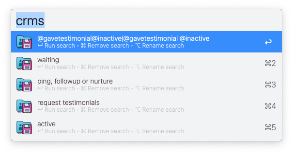
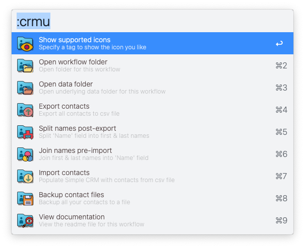

# Simple CRM

### World's simplest, fastest, most usable CRM — via Alfred

**The problem with most CRMs...**

✘  Hassle to load an app  
✘  Too long to log in online  
✘  Too slow to add new contacts  
✘  Too cumbersome to find existing ones  
✘  And more features than most users need

**But with Simple CRM...** 

**✓**  Load immediately, thanks to Alfred  
**✓**  Add new contacts — blazingly simple & fast  
**✓**  Find them — even faster  
**✓**  Use tags to filter in infinite ways  
**✓**  Use your favorite editor for all contact files  
**✓**  Save any search using the `enter` key  
**✓**  Smart Icons for lead status & more *(completely configurable)*

**More...**

**Simple CRM is a (super) lightweight, workflow built around files**. You open & edit these files with your favorite editor. This workflow makes it easy & fast to define, add, tag, find &  view contacts. And has tools to import, export & backup all your contacts. 

Simple CRM is built for power users, freelancers & anyone wanting less — to do more.

Give it a shot. Tell me what ya like. And what sucks. I'll make it un-suck.

▸ [Download latest workflow](https://github.com/modrocko/simple-crm/releases/latest)

## Usage

### Set up

Got existing contacts in your current CRM? Cool. Import them into Simple CRM.

- Export contacts to a .csv file
- Define your fields in Simple CRM via `Configure Workflow`❗
- Set  `CRM path` for all contact files
- Set the `import` & `export` paths & `export` fields
- Select `Import contacts` from Simple CRM `utilities` 

Voila. A new file created for each contact.

❗**Two fields are required when defining your custom fields:**

(1) `Name` consists of full name & and must be in the 1st position

(2) `Lead Status` is used to show all the icons for this field

### Tags for `Lead Status`

**Tags provide mucho power to categorize your leads.** They save you from having to create & complete too many fields too. And making search *real* easy. And fast! [See more about tags & icons](#tags-and-icons-for-lead-status).

## Main workflows

  

### ▸ Add new contact

Adding contacts is as simple as it gets. Start typing to add a new contact, using a subset of fields defined in `Configure Workflow`. And informing you which field you're currently entering *(in CAPs)*. Fill in any or all fields.

  

<kbd>↵</kbd>  To create new contact file in your CRM folder

<kbd>⌘</kbd><kbd>↵</kbd> To create new contact file — then open for further editing

### ▸ List & Search contacts

Imagine finding *any contact* in seconds. And finding *a set of contacts* in few seconds more. Simple CRM was built for this.

#### List Contacts

List all contacts, ready for filtering.

    

<kbd>↵</kbd> To open selected contact in your editor

<kbd>⌘</kbd><kbd>↵</kbd> To view contact (then select <kbd>⌘</kbd><kbd>O</kbd> to edit contact)

#### Search contacts

Combine tags or any search fields *(as defined in `Configure Workflow`)* to filter rows — using basic AND/OR logic. This is the most powerful feature in Simple CRM. [See more filtering examples & rules](#Search-Filter-Rules).

   

   

     

#### For summary row

<kbd>↵</kbd> To save currently applied filtering as a `saved search`

<kbd>⌘</kbd><kbd>↵</kbd> To perform bulk update for all filtered contacts (see `Update Contacts` section below)

<kbd>⌥</kbd><kbd>↵</kbd> To open contact files for all filtered contacts

<kbd>⌃</kbd><kbd>↵</kbd> To export contacts into .csv for all filtered contacts

#### For all contact rows

<kbd>↵</kbd> To open contact file for currently select contact

<kbd>⌘</kbd><kbd>↵</kbd> To view contact (then select <kbd>⌘</kbd><kbd>O</kbd> to edit contact)

#### Universal Actions

Key Universal actions include: 

**For 1st row:** 

`Search in Finder` - Show all currently filtered contacts in Finder

**For all contact rows**

`View in Alfred` | `Open`  | `Reveal in Finder`  | `Delete`

### ▸ Run a saved search

Save any filtered contacts from above to a saved search.

     

<kbd>↵</kbd> To run this search

<kbd>⌘</kbd><kbd>↵</kbd> To remove this search

<kbd>⌘</kbd><kbd>⌥</kbd> To rename this search

### ▸ List recent contacts

List the most recently opened contact files.

    

#### For summary row

<kbd>↵</kbd> To clear this recents list

#### For all contact rows

<kbd>↵</kbd> To open selected contact file

<kbd>⌘</kbd><kbd>↵</kbd> To clear selected contact from this recents list

### ▸ Show reminders

Use this command to quickly show all upcoming reminders you may have set

 

  

<kbd>↵</kbd> To edit highlighted contact

<kbd>⌘</kbd><kbd>↵</kbd> To quick-view highlighted contact

<kbd>⌥</kbd><kbd>↵</kbd> To set reminder for highlighted contact in Reminders app or as a Calendar event*

\* You must set the calendar to use in `Configure Workflow`.

**Supported Date Formats**

- `%Y-%m-%d` → 2025-08-20  
- `%m/%d/%Y` → 08/20/2025  
- `%b %d %Y` → Aug 20 2025  

### Tags and Icons for Lead Status

**Symbols allow for quick recognition for all contact rows.** I created out-of-the-box icons below for the specified tags. This is completely configurable by adding or changing icons in the `/icons` folder. The workflow will automatically assign tags with icons *(if they exist)*, for example: `@meeting` will display `meeting.png`.

**Combine tags to tell the story for each contact:**  ex. `@hot @lead` ***Note:** The 1st tag listed determines the icon to be used in the field `Lead Status`.* Use any tag you think of as you go — there are no limitations.

**A list of tags & associated icons below** —with more coming!

 `@active` `@awaitingpayment` `@cold` `@deciding` `@followup` `@hot` `@lead` `@loss` `@meeting` `@past` `@meh` `@pause` `@ping` `@reminder` `@waiting` `@won`

  

❗**Note:** You must define the field, `Lead Status` in `Configure Workflow`  to display any icons for contacts.

### Search Filter Rules

Searching is  a powerful beast. Use them. Save them. This functionality kicks in when listing contacts. 

**AND by default**  
 `@lead @followup @active` → matches items with all 3 tags  

**OR logic**  
 `@hot OR @cold OR @pause` → matches any of the tags  

**NOT logic**  
 `@ping OR @waiting !@past` → matches ping or waiting, but excludes past  
 `@lead -@loss` → matches @lead but excludes @loss  

**Phrases**  
 `"awaiting payment" OR @reminder` → matches the exact phrase or @reminder  

**Field match**  
 `email:gmail.com` → matches items where email field contains `gmail.com`  
 `name:"Jane Doe"` → matches items where name field is exactly `"Jane Doe"`  

**Has field**  
 `has:phone` → matches items where phone field is not empty  
 `!has:company` → matches items with an empty or missing company field  

All searches are case-insensitive.

### Update Contacts

This is a **bulk replace** feature. It does **a plain-text find & replace** across all contacts for the currently filtered rows via the `List Contacts` function.

- **Any text string** in the file can be replaced
- **Case-insensitive** match (`ACME`, `acme`, `AcMe` → all replaced)
- **All occurrences** in the file get updated

### Utilities

Some useful tools to manage your contact files. And to peek into your data and workflow folders.

 

​     

